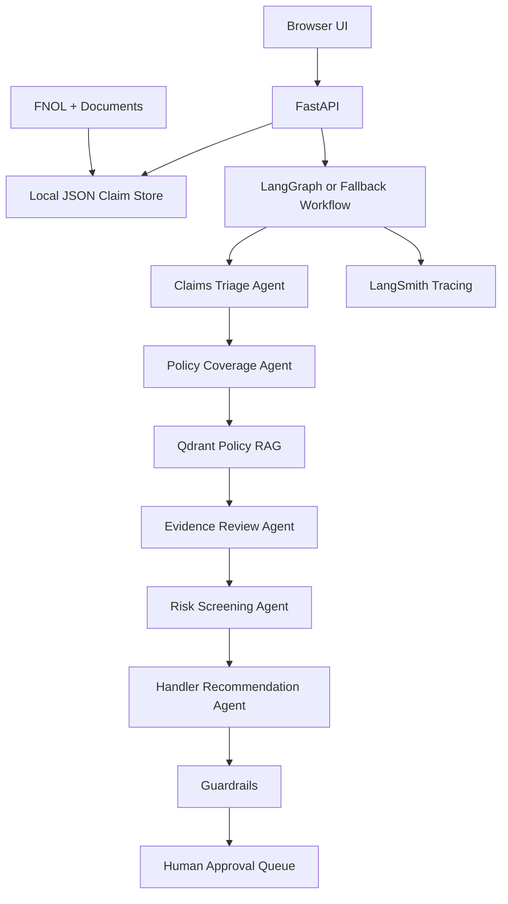

# Claims Agentic AI MVP - FastAPI + Multi-Agent Claims Workflow

This is a local, testable MVP for a multi-agent insurance claims support workflow. It includes a FastAPI backend, a browser UI for submitting generated claims, optional Groq LLM calls, Qdrant-backed policy retrieval, LangGraph-style orchestration, LangSmith tracing hooks, and evaluation scripts.

It includes:

- FastAPI backend
- Browser UI at `/` for selecting and running claims from `data/claims`
- Agent workflow visualization showing what each agent handled
- Document workflow view showing reviewed documents, missing evidence, conflicts, and extracted fields
- Policy retrieval view showing coverage summary and retrieved policy clauses
- Groq LLM client, configurable with `GROQ_MODEL` and currently defaulting to `llama-3.1-8b-instant`
- LangGraph-style workflow orchestration with optional real LangGraph support
- Qdrant vector search for policy RAG
- Synthetic data generator for up to 10,000 claims
- Policy indexing with metadata filters
- Claims Triage Agent
- Policy Coverage Agent
- Evidence Review Agent
- Risk Screening Agent
- Handler Recommendation Agent
- Output guardrails and human approval flags
- LangSmith tracing hooks
- Evaluation scripts

For detailed architecture and operating documentation, see [docs/PROJECT_DOCUMENTATION.md](docs/PROJECT_DOCUMENTATION.md).

## 1. Prerequisites

The policy coverage agent expects Qdrant at:

```bash
http://localhost:6333
```

Example Qdrant command:

```bash
docker run -p 6333:6333 -p 6334:6334 qdrant/qdrant
```

Python:

```bash
python --version
# Python 3.14.x
```

## 2. Create environment

```bash
cd claims_agentic_ai_mvp
python -m venv .venv
source .venv/bin/activate   # macOS/Linux
# .venv\Scripts\activate    # Windows PowerShell

pip install -U pip
pip install -r requirements.txt
```

## 3. Configure environment

Copy `.env.example` to `.env`:

```bash
cp .env.example .env
```

Edit `.env`:

```bash
GROQ_API_KEY=your_groq_key
LANGSMITH_API_KEY=your_langsmith_key
LANGSMITH_TRACING=true
LANGSMITH_PROJECT=claims-agentic-ai-mvp
QDRANT_URL=http://localhost:6333
```

If you do not set `GROQ_API_KEY`, the app runs in deterministic mock LLM mode so you can still test the workflow.

## 4. Generate synthetic data

Generate 10,000 synthetic claims and sample policy docs:

```bash
python scripts/generate_data.py --records 10000
```

This creates:

```text
data/claims/synthetic_claims.jsonl
data/policies/motor_policy.md
data/policies/home_policy.md
data/documents/synthetic_documents.jsonl
```

## 5. Index policies into Qdrant

```bash
python scripts/index_policies.py
```

## 6. Start API

```bash
uvicorn app.main:app --reload --port 8000
```

Open the browser UI:

```text
http://localhost:8000/
```

Use the dropdown to pick a claim from `data/claims/synthetic_claims.jsonl`, then submit it to run the workflow and view:

- workflow summary
- all agents involved
- document review details
- policy retrieval details
- recommendation and human approval flags
- raw API response

Open the API documentation:

```text
http://localhost:8000/docs
```

## 7. Test the workflow

Health check:

```bash
curl http://localhost:8000/health
```

Run claim workflow:

```bash
curl -X POST http://localhost:8000/claims/CLM-000001/run
```

Search policy clauses:

```bash
curl -X POST http://localhost:8000/policies/search \
  -H "Content-Type: application/json" \
  -d '{"query":"motor accidental damage third party excess", "product_type":"motor", "top_k":5}'
```

Run evaluation on 100 generated cases:

```bash
python scripts/run_evaluation.py --limit 100
```

Or through API:

```bash
curl -X POST "http://localhost:8000/evaluate?limit=100"
```

## 8. Architecture



## 9. Browser UI

The UI is served from:

```text
app/static/index.html
```

It calls the same API endpoints that were previously used with curl:

- `GET /health`
- `GET /claims?limit=50`
- `POST /claims/{claim_id}/run`

The output page includes an `Agent Workflow` section with:

- Claims Triage Agent
- Policy Coverage Agent
- Evidence Review Agent
- Risk Screening Agent
- Handler Recommendation Agent
- Output Guardrails

It also includes a `Document Workflow` section for reviewed documents and a `Policy Retrieval` section for Qdrant/RAG results.

## 10. Notes on Python 3.14.x

FastAPI added Python 3.14 support in its release notes. LangGraph is Python 3.10+ but some optional LangGraph CLI/native dependency stacks have reported Python 3.14 issues. This MVP therefore uses a safe workflow adapter:

- It tries to use LangGraph when installed.
- If LangGraph has an environment issue, it falls back to a deterministic local graph runner with the same node order.

That allows you to test locally while keeping the design aligned with LangGraph.

## 11. Main files

```text
app/main.py                         FastAPI app
app/static/index.html               Browser UI
app/agents/workflow.py              LangGraph/fallback workflow
app/agents/triage_agent.py          Claims triage
app/agents/policy_coverage_agent.py RAG policy lookup
app/agents/evidence_review_agent.py Evidence review
app/agents/risk_screening_agent.py  Risk rules
app/agents/recommendation_agent.py  Handler recommendation
app/rag/qdrant_store.py             Qdrant integration
app/rag/embeddings.py               Local deterministic embeddings
app/rag/chunking.py                 Section-aware chunking
scripts/generate_data.py            Synthetic data generator
scripts/index_policies.py           Policy indexing
scripts/run_evaluation.py           Evaluation runner
docs/PROJECT_DOCUMENTATION.md       Detailed project documentation
```
