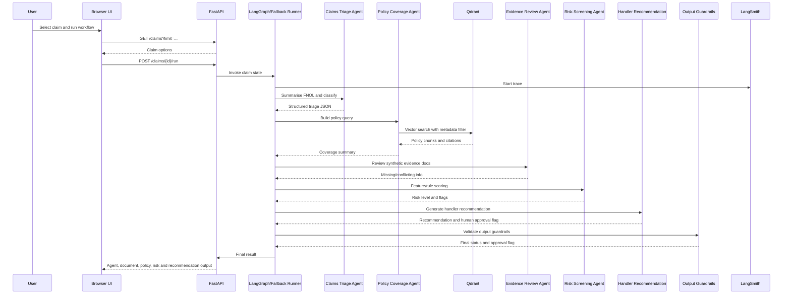

# Local Claims Agentic AI MVP - Engineering Implementation

## Process flow



## Key design choices

- Groq is optional at runtime. If `GROQ_API_KEY` is missing, deterministic mock logic is used so the local MVP still runs.
- Qdrant is required for policy RAG search.
- Embeddings use a local hashing embedder to avoid Python 3.14 native dependency problems.
- LangGraph is attempted first. If your Python 3.14 environment has dependency issues, the app falls back to a simple graph runner with the same nodes.
- LangSmith decorators are optional. If configured, traces are sent to your LangSmith project.
- The browser UI is static HTML/CSS/JavaScript served by FastAPI from `app/static/index.html`.
- The UI visualizes the multi-agent architecture with agent-level outputs, document review details, policy retrieval details and raw JSON.

## Agents

1. Claims Triage Agent
   - Extracts claim type, urgency, complexity, incident facts and missing information.

2. Policy Coverage Agent
   - Searches Qdrant using product metadata filter.
   - Returns cited policy chunks and a coverage summary.

3. Evidence Review Agent
   - Reads generated synthetic evidence documents.
   - Highlights missing documents and conflicting dates.

4. Risk Screening Agent
   - Applies feature-based risk scoring and rules.
   - Flags high frequency, inflated cost, early policy claim, duplicate invoice, and date conflicts.

5. Handler Recommendation Agent
   - Produces final handler-facing recommendation.
   - Does not make final settlement decisions.

6. Output Guardrails
   - Blocks final claim decision language.
   - Requires human review for missing policy clauses or elevated risk.

## Browser UI

The main UI is available at:

```text
http://localhost:8000/
```

It uses:

- `GET /health`
- `GET /claims?limit=...`
- `POST /claims/{claim_id}/run`

The UI displays:

- workflow summary
- each agent involved and what it handled
- document workflow and extracted evidence fields
- policy retrieval and retrieved clause metadata
- recommendation, risk flags, missing information and raw response

## Evaluation

`python scripts/run_evaluation.py --limit 100` reports:

- claim type accuracy
- urgency accuracy
- average citations retrieved
- human approval rate
- risk level distribution
- sample case results
