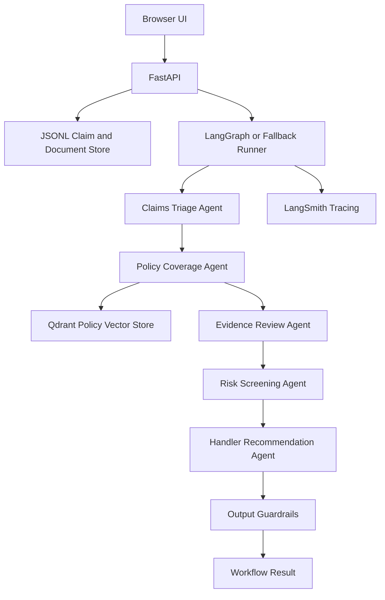

# Claims Agentic AI MVP Documentation

## Overview

This project is a local insurance claims workflow MVP. It demonstrates how a claim can move through a set of specialized agents that classify the incident, retrieve policy context, review evidence, screen risk, recommend handler action, and apply output guardrails.

The system can be used in two ways:

- Browser UI: `http://localhost:8000/`
- API docs and direct API testing: `http://localhost:8000/docs`

The browser UI is intended to replace manual curl usage for the main claim workflow. It loads claims from `data/claims/synthetic_claims.jsonl`, lets a user select one, submits it to the backend, and visualizes the multi-agent output.

## System Components



## Runtime Flow

1. The UI calls `GET /claims?limit=...` to load claim options.
2. The user selects a claim and clicks `Run Workflow`.
3. The UI calls `POST /claims/{claim_id}/run`.
4. FastAPI loads the claim from `data/claims/synthetic_claims.jsonl`.
5. The workflow runs through each agent in order.
6. The final response is returned to the UI.
7. The UI renders summary fields, the agent workflow, document workflow, policy retrieval details, risk flags, missing information, and the raw JSON response.

## Agents

### Claims Triage Agent

File: `app/agents/triage_agent.py`

Purpose:

- Reads FNOL text and structured claim fields.
- Classifies `claim_type`.
- Sets `urgency` and `complexity`.
- Extracts `incident_facts`.
- Produces `triage_summary`.

Important output fields:

- `claim_type`
- `urgency`
- `complexity`
- `incident_facts`
- `triage_summary`
- `human_approval_required` when confidence is low

### Policy Coverage Agent

File: `app/agents/policy_coverage_agent.py`

Purpose:

- Builds a policy search query from product type, claim type, incident facts, and FNOL text.
- Searches Qdrant for relevant policy clauses.
- Adds retrieved clauses to the workflow state.
- Generates a coverage summary.

Important output fields:

- `retrieved_policy_clauses`
- `coverage_summary`
- `human_approval_required` when no clauses are found or confidence is low
- `fallback_reason`

The UI supports both string and structured object coverage summaries. If the LLM returns an object, the UI renders it as readable label/value text rather than `[object Object]`.

### Evidence Review Agent

File: `app/agents/evidence_review_agent.py`

Purpose:

- Loads supporting documents from `data/documents/synthetic_documents.jsonl`.
- Checks for required document types: `invoice`, `photo`, and `loss_report`.
- Extracts document IDs, document types, amounts, references, and incident dates.
- Detects date conflicts between document evidence and FNOL.

Important output fields:

- `evidence_review.documents_reviewed`
- `evidence_review.document_types`
- `evidence_review.extracted`
- `evidence_review.missing_information`
- `evidence_review.conflicts`
- `evidence_review.critical_conflicts`
- `evidence_review.confidence`

### Risk Screening Agent

File: `app/agents/risk_screening_agent.py`

Purpose:

- Builds deterministic risk features.
- Applies risk rules.
- Scores the claim.
- Flags cases requiring fraud or specialist review.

Important output fields:

- `risk_flags`
- `risk_score`
- `risk_level`
- `fraud_referral_required`
- `human_approval_required`

### Handler Recommendation Agent

File: `app/agents/recommendation_agent.py`

Purpose:

- Combines triage, coverage, evidence, and risk context.
- Selects a deterministic route before any AI drafting occurs.
- Uses the LLM to draft a handler-facing explanation within the allowed deterministic route.
- Explains what the handler should do next, why, which evidence supports or weakens the claim, which policy clauses matter, what questions to ask, what documents to request, and whether specialist review is needed.
- Avoids final settlement decisions.

Important output fields:

- `handler_recommendation`
- `handler_recommendation.deterministic_route`
- `handler_recommendation.recommended_action`
- `handler_recommendation.recommendation_summary`
- `handler_recommendation.rationale`
- `handler_recommendation.supporting_evidence`
- `handler_recommendation.weakening_evidence`
- `handler_recommendation.relevant_policy_clauses`
- `handler_recommendation.customer_questions`
- `handler_recommendation.missing_documents_to_request`
- `handler_recommendation.specialist_review_needed`
- `handler_recommendation.recommendation_confidence`
- `handler_recommendation.ai_drafted`
- `handler_recommendation.evidence_status`
- `handler_recommendation.top_policy_citations`
- `final_status`

Control constraints:

- If `fraud_referral_required` is true, the deterministic route is fraud or specialist review and the AI draft cannot recommend normal progression.
- If evidence is missing or conflicting, `evidence_status` remains incomplete and missing documents are preserved in `missing_documents_to_request`.
- If no policy clauses were retrieved, the AI draft is not allowed to present policy confidence or relevant policy citations.
- If the AI draft contains final decision language, the recommendation agent replaces it with a deterministic fallback draft.
- Output guardrails still run after recommendation drafting and can require human approval.

### Output Guardrails

File: `app/agents/guardrails.py`

Purpose:

- Blocks final decision language such as claim accepted, claim rejected, fraud confirmed, or policy void.
- Requires human review when policy clauses are missing.
- Requires human review for medium or high risk levels.

Important output fields:

- `human_approval_required`
- `fallback_reason`
- `final_status`

## Browser UI

File: `app/static/index.html`

The UI is a no-build HTML/CSS/JavaScript page served by FastAPI.

Main sections:

- Submit Claim: choose how many claims to load and select a claim.
- Workflow Results: high-level result status, type, urgency, and complexity.
- Agent Workflow: each agent, what it handled, and what it produced.
- Recommendation: route, evidence status, risk level, and recommended action.
- Incident Summary: triage summary from FNOL.
- Document Workflow: document count, document types, extracted document fields, missing evidence, and conflicts.
- Policy Retrieval: coverage summary and retrieved policy clause metadata.
- Risk Flags: rule-based risk flags.
- Missing Information: missing evidence or claim details.
- Raw Response: complete API JSON response.

The UI uses:

- `GET /health`
- `GET /claims?limit=...`
- `POST /claims/{claim_id}/run`

## API Reference

### `GET /`

Serves the browser UI.

### `GET /health`

Returns runtime health and configuration status.

Example response:

```json
{
  "status": "ok",
  "use_groq": false,
  "qdrant_url": "http://localhost:6333",
  "qdrant_collection": "policy_chunks",
  "langsmith_project": "claims-agentic-ai-mvp"
}
```

### `GET /claims?limit=20`

Returns claims from `data/claims/synthetic_claims.jsonl`.

### `GET /claims/{claim_id}`

Returns one claim by ID.

### `POST /claims/{claim_id}/run`

Runs the full multi-agent workflow for one claim.

Response shape:

```json
{
  "claim_id": "CLM-000001",
  "status": "ready_for_handler_review",
  "result": {
    "claim_id": "CLM-000001",
    "claim_type": "home_storm_damage",
    "urgency": "low",
    "complexity": "standard",
    "retrieved_policy_clauses": [],
    "coverage_summary": "...",
    "evidence_review": {},
    "risk_flags": [],
    "handler_recommendation": {},
    "human_approval_required": false,
    "final_status": "ready_for_handler_review"
  }
}
```

### `POST /policies/search`

Searches indexed policy clauses.

Request:

```json
{
  "query": "motor accidental damage third party excess",
  "product_type": "motor",
  "top_k": 5
}
```

### `POST /policies/ensure-collection`

Creates the Qdrant collection when missing.

### `POST /evaluate?limit=100`

Runs evaluation through the API.

## Data Files

```text
data/claims/synthetic_claims.jsonl       Synthetic claim records
data/documents/synthetic_documents.jsonl Synthetic evidence documents
data/policies/motor_policy.md            Motor policy source text
data/policies/home_policy.md             Home policy source text
```

## Setup

Create a virtual environment:

```bash
python -m venv .venv
source .venv/bin/activate
# Windows PowerShell:
# .venv\Scripts\activate
```

Install dependencies:

```bash
pip install -U pip
pip install -r requirements.txt
```

Configure `.env`:

```bash
GROQ_API_KEY=your_groq_key
USE_GROQ=true
GROQ_MODEL=llama-3.1-8b-instant
LANGSMITH_API_KEY=your_langsmith_key
LANGSMITH_TRACING=true
LANGSMITH_PROJECT=claims-agentic-ai-mvp
QDRANT_URL=http://localhost:6333
QDRANT_COLLECTION=policy_chunks
```

If `GROQ_API_KEY` is missing or `USE_GROQ` is not enabled, the app uses deterministic mock LLM logic.

## Running Locally

Start Qdrant:

```bash
docker run -p 6333:6333 -p 6334:6334 qdrant/qdrant
```

Generate data:

```bash
python scripts/generate_data.py --records 10000
```

Index policies:

```bash
python scripts/index_policies.py
```

Start FastAPI:

```bash
uvicorn app.main:app --reload --port 8000
```

Open:

```text
http://localhost:8000/
```

## Evaluation

Run evaluation from the command line:

```bash
python scripts/run_evaluation.py --limit 100
```

Or through the API:

```bash
curl -X POST "http://localhost:8000/evaluate?limit=100"
```

Evaluation reports:

- claim type accuracy
- urgency accuracy
- average citations retrieved
- human approval rate
- risk level distribution
- sample case results

## Configuration

File: `app/config.py`

Key settings:

- `DATA_DIR`: base data directory, default `data`
- `GROQ_API_KEY`: enables Groq when present and `USE_GROQ=true`
- `USE_GROQ`: controls real LLM calls
- `GROQ_MODEL`: Groq model name, default `llama-3.1-8b-instant`
- `QDRANT_URL`: Qdrant URL, default `http://localhost:6333`
- `QDRANT_COLLECTION`: policy collection name, default `policy_chunks`
- `VECTOR_SIZE`: hashing embedder vector size, default `384`
- `LANGSMITH_TRACING`: enables LangSmith tracing
- `LANGSMITH_PROJECT`: LangSmith project name

## Development Notes

- `app/agents/workflow.py` attempts LangGraph first.
- If LangGraph cannot run in the local environment, the fallback runner executes the same nodes in order.
- The policy retrieval stack uses a local deterministic hashing embedder to avoid native embedding dependency issues.
- The handler recommendation route is deterministic, but the explanation is AI-drafted when LLM mode is enabled. Mock mode returns deterministic draft text for local testing.
- Recommendation list outputs are normalized to human-readable strings so model-returned objects do not appear as raw JSON in the UI.
- The browser UI is intentionally static and framework-free, so no frontend build command is required.
- The UI calls same-origin API paths, so it works when served by FastAPI at `/`.

## Troubleshooting

### Browser UI loads but claim list is empty

Run:

```bash
python scripts/generate_data.py --records 10000
```

### Policy coverage says no clauses were retrieved

Make sure Qdrant is running and policies are indexed:

```bash
python scripts/index_policies.py
```

### The app uses mock LLM mode

Check `.env`:

```bash
GROQ_API_KEY=...
USE_GROQ=true
```

Then restart FastAPI.

### Human approval is required often

This is expected for cases with missing evidence, conflicts, medium/high risk, missing policy clauses, or low LLM confidence. The MVP is designed to support handler review, not make final claim decisions.
